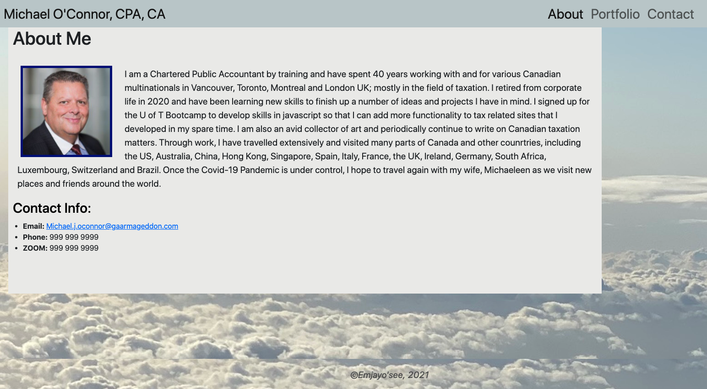
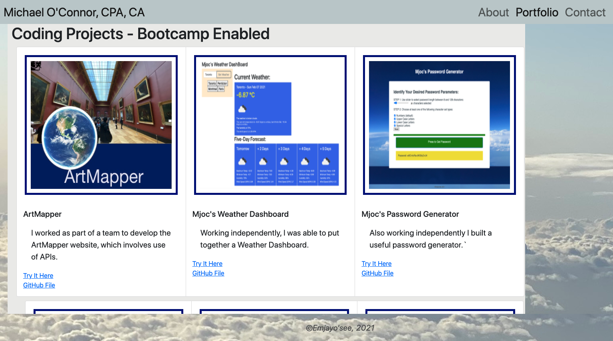
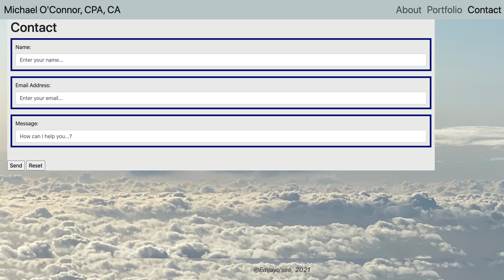

# Assignment08
This is the repo for Assignment 08 and updated Portfolio.

Here is a link to the deployed file https://emjayosee.github.io/Assignment08/.

# 01 Goal:

 The Goal of this project is to update the portfolio we created in Assignment 02, imporve it with things we now know and reference some of our projects. Here is a link to the Github folder https://github.com/Emjayosee/Assignment08 and a link to the deployed shell https://emjayosee.github.io/Assignment08/.

# 02 Approach:

    In approching this project, I took subsequent learnings and made improvements to the portfolio and added the Project One and a couple of the other Assignments I have created.  .

# 03 Testing and Quality Control:

    1. I have tested each link to confirm functionality.

    2. HTML Code has been formatted to make it easier to follow when viewed at source.

    3. I have loaded the files and tested the page functionality at GITHUB.

    4. I made the images a bit more responsive.

# 04 Lessons Learned:

The following items should be considered for future enhancements, time and budget permitting:

    1. THere is not a lot of JAVASCRIPT used and I should think up ways to add some.

    2. Added an email link to allow users to send me an email from the Contact page.

# 05 Further improvements to make:

    1. Incorporate social media link buttons for twitter, facebook and youtube.  Media queries have been minimized in this version of the portfolio as instructed.

    2. Add actual links to social media, linked-in and youtube (I do not use facebook) I held off on personal contact detail for future effort.

# 06 Current Renderings:

See Current Rendering at the time of writing in the Assignment01 Repo. 
 
 
 